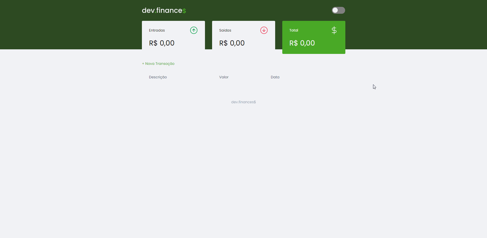
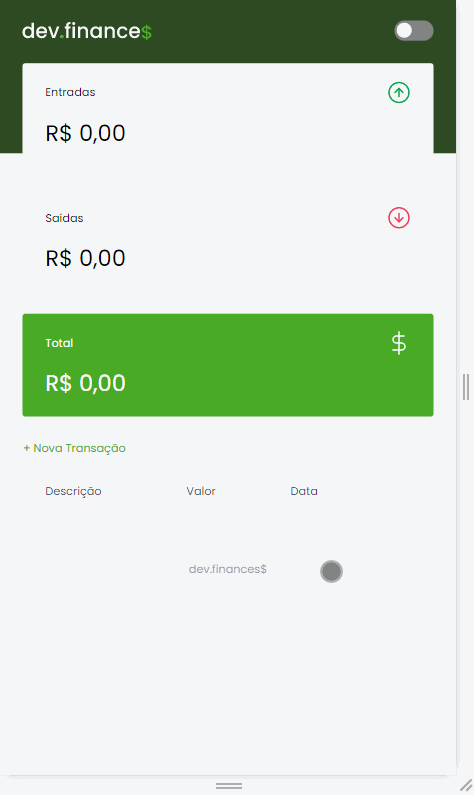
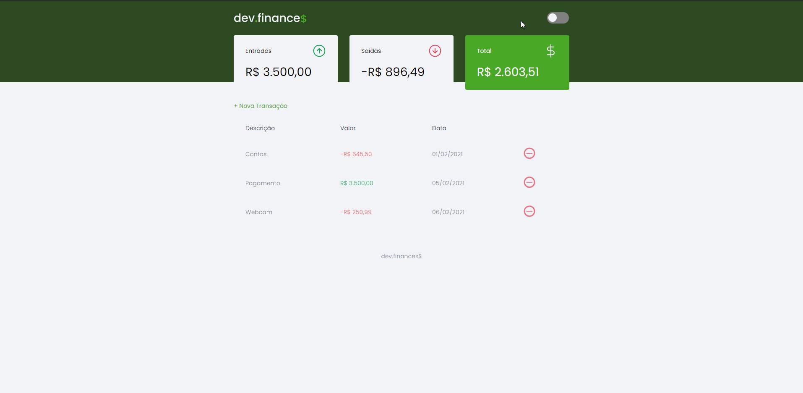
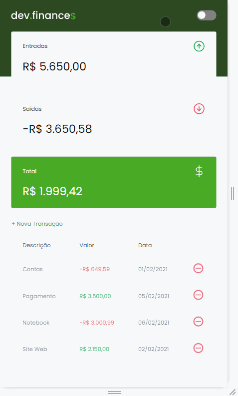

<h1 align="center">Projeto Dev Finance </h1>

    Projeto super bacana, onde você pode colocar seus gastos e lucros e o próprio site faz o calculo do total das entradas e saídas.

    Foi utilizado o <b>local storage</b> para fazer o armazenamento das informações.

 

    
    

 
 

<h1 align="center">Dark Mode</h1>

    
    

 
 

## 🚩 Tecnologias

- HTML ✔
- CSS ✔
- JavaScript ✔
